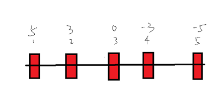

# 电控三轮验收
## 硬件整体配置

### 五路巡线GPIO

### 简单按键菜单 
下拉输入 接入之前的菜单
可以利用状态机实现巡线时特殊状态保证巡线执行效率

### 电机配置 
和二轮验收保持一致的接线方法,可以直接移植代码
需要封装两个转向函数,通过调控转向时间来确定转向力度

### 编码器配置

### MPU
姿态解算速通

## 代码思路

### 整体
MPU用于实现循迹之间的空隙区域,保证有连续的输入,通过光电加陀螺仪的方式实现转向环接近连续的输入
环岛给一个特判 
十字部分 全黑的输入,不停止工作

### PID双环实现
转向环加上速度环
转向环的输入需要加上差速部分
内环速度环注意范围整定

有黑线是0 白色是1
